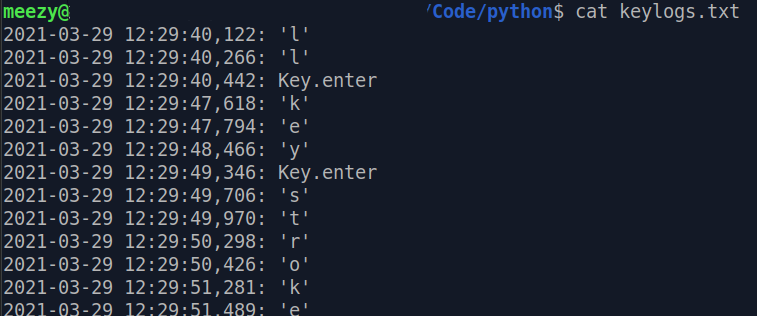

# A very basic python3 keylogger

### Overview
This is an example of a basic **python3** keylogger.

It requires **pynput** to run.

To install it, just run:

```
pip3 install pynput
```

Type the bellow command to run the program in your terminal:

```
python3 keylogger.py&
```

I've added **&** in the final to release the terminal while the program is running.

##### Example


It creates an output file named **keylogs.txt** in the running directory:


Print the output:




Contributions are always welcome!
